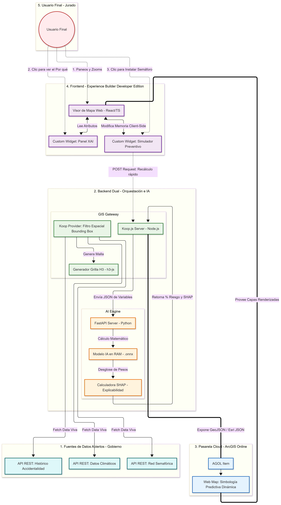

# Arquitectura del Sistema Predictivo de Accidentalidad Vial
**Concurso Datos al Ecosistema 2026: IA para Colombia**

## 1. Visión General del Sistema
El presente documento describe la arquitectura diseñada para el sistema predictivo de accidentalidad vial. El enfoque tecnológico garantiza la no duplicidad de datos estáticos, el uso de Inteligencia Artificial al vuelo y la escalabilidad del sistema, cumpliendo con los estándares de evaluación del concurso y la metodología CRISP-ML.

## 2. Metodología CRISP-ML (Flujo de Trabajo)

La arquitectura soporta directamente el ciclo de vida del aprendizaje automático (CRISP-ML) exigido para el reto:
1. **Comprensión de Datos y Preparación (Offline):** Extracción histórica de datos de accidentalidad e infraestructura (datos.gov.co). Uso de Python para limpieza, cruce con grillas espaciales (H3) e ingeniería de características (Feature Engineering).
2. **Modelado (Offline):** Entrenamiento de un modelo de Machine Learning tabular (XGBoost/Random Forest). Extracción de pesos matemáticos y empaquetado en formato universal (`.onnx`).
3. **Despliegue y Evaluación (Online):** Inferencia en tiempo real utilizando un backend dual (Node.js + Python) que aplica explicabilidad mediante Valores SHAP sobre datos vivos, evitando la duplicidad.

---

## 3. Capas Tecnológicas

### Capa 1: Orígenes de Datos (Gobierno)
* **Tecnología:** APIs REST oficiales (datos.gov.co, RUNT, Secretarías de Movilidad).
* **Descripción:** Fuentes de datos abiertos consultadas al vuelo.
* **Variables clave:** Puntos históricos de accidentes, red semafórica actual, clima, tipología vial.

### Capa 2: Motor Espacial - GIS Gateway
* **Tecnología:** Node.js, Koop.js, `h3-js`.
* **Lenguaje:** JavaScript.
* **Responsabilidad:** Actuar como traductor entre el mundo SIG y las APIs web. 
* **Flujo:**
    1. Intercepta el *Bounding Box* del visor del usuario.
    2. Genera dinámicamente la grilla hexagonal (H3, Resolución 9/10) únicamente para el encuadre visible.
    3. Consulta los servicios REST del gobierno para esa extensión.
    4. Agrega los datos y envía el payload al Motor de IA.
    5. Formatea la respuesta final como un *Feature Service* (GeoJSON).

### Capa 3: Motor de IA e Inferencia
* **Tecnología:** Python, FastAPI, `onnxruntime`, `shap`.
* **Lenguaje:** Python.
* **Responsabilidad:** Ejecutar cálculos matemáticos predictivos y generar explicabilidad (XAI).
* **Flujo:**
    1. Mantiene el modelo `.onnx` cargado en memoria RAM.
    2. Recibe el payload de variables agrupadas por hexágono desde Koop.js.
    3. Realiza la inferencia para calcular la probabilidad de accidente (%).
    4. Aplica lógica de Valores SHAP para descomponer matemáticamente la influencia de cada variable en el riesgo.
    5. Devuelve la matriz enriquecida a Koop.js en milisegundos.

### Capa 4: Pasarela Cloud y Web Map
* **Tecnología:** ArcGIS Online (AGOL).
* **Responsabilidad:** Actuar como middleware de configuración visual sin almacenar geometrías.
* **Flujo:** Registro de la URL del *Provider* de Koop.js como un *Item* web. Configuración de simbología inteligente (rampas de color condicionales al porcentaje de riesgo) y rangos de dependencia de escala (Scale Dependency) para optimizar peticiones.

### Capa 5: Interfaz de Usuario e Interacción (Frontend)
* **Tecnología:** ArcGIS Experience Builder Developer Edition, React, TypeScript, ArcGIS Maps SDK for JavaScript.
* **Responsabilidad:** Renderizar la UI y gestionar la experiencia del usuario final (tomadores de decisiones).
* **Componentes Clave (Custom Widgets):**
    * **Widget de Explicabilidad (XAI):** Lee los atributos SHAP del hexágono seleccionado y grafica el aporte de las variables en tiempo real (interpretabilidad).
    * **Simulador Preventivo (What-If):** Widget en el lado del cliente (Client-Side Geometry Engine) que permite la modificación virtual de infraestructura (ej. agregar un semáforo). Altera la variable en memoria, realiza una petición `POST` al backend y recalcula dinámicamente el riesgo en pantalla.

---

## 4. Estructura del Despliegue (CI/CD)
* **Control de Versiones:** Git / GitHub. Repositorio público obligatorio según lineamientos del concurso (garantizando auditabilidad y transparencia).
* **Hosting Backend:** Instancias serverless (ej. Vercel, Render) para Node.js y FastAPI.
* **Hosting Frontend:** Despliegue estático de la compilación de React (Vercel, GitHub Pages).
