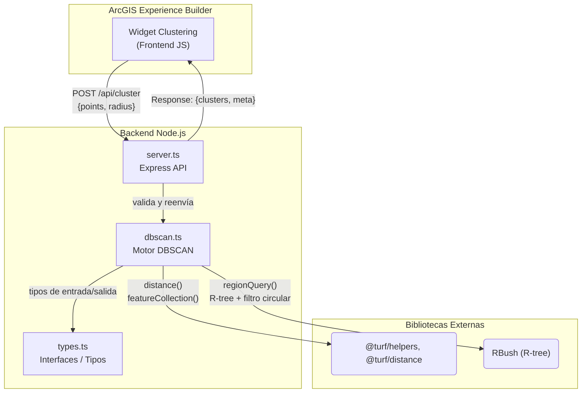

# Backend de Clustering DBSCAN (Turf.js + RBush)


**Proyecto:** Concurso Datos al Ecosistema 2026 — IA para Colombia
**Sistema:** Predictivo de accidentalidad vial en Bogotá D.C.

Servicio de análisis espacial que recibe puntos geográficos y un radio de búsqueda
desde el **widget DBSCAN Clustering de ArcGIS Experience Builder**, aplica el
algoritmo **DBSCAN** con una **implementación optimizada propia** (R-tree con RBush
+ filtro circular con Turf.js) y devuelve los resultados etiquetados para
visualización interactiva en el frontend.

> **Nota técnica:** A diferencia de usar `@turf/clusters-dbscan` directamente (que
> implementa una búsqueda de vecinos ingenua O(n²)), esta implementación construye
> un índice espacial R-tree con RBush para las consultas de vecindad, logrando un
> rendimiento práctico cercano a O(n log n) en conjuntos de datos con miles de
> puntos de accidentalidad.

---

## Arquitectura



**Flujo de datos:**
1. El widget envía los puntos (GeoJSON `FeatureCollection` o arreglo `[lon, lat]`)
   y un radio en metros vía `POST /api/cluster`.
2. El servidor Express normaliza la entrada y ejecuta DBSCAN con Turf.js.
3. Cada punto se etiqueta como `core` (núcleo), `edge` (borde) o `noise` (ruido).
4. La respuesta incluye el `FeatureCollection` etiquetado y metadatos del
   agrupamiento (total de puntos, cantidad de clusters, puntos de ruido).

---

## Tecnologías y Herramientas

| Tecnología | Versión | Propósito |
|---|---|---|
| **Node.js** | ≥20 | Runtime del servidor |
| **TypeScript** | 5.5 | Lenguaje con tipado estático |
| **Express** | 4.19 | Framework HTTP (routing, middleware) |
| **RBush** | 4.0 | Índice espacial R-tree para consultas de vecindad O(log n) |
| **@turf/distance** | 7.3 | Cálculo de distancia geodesica (great-circle) precisa |
| **@turf/helpers** | 7.1 | Creación de FeatureCollections y Points |
| **cors** | 2.8 | Middleware CORS para integración cross-origen con ArcGIS |
| **ts-node-dev** | 2.0 | Recarga en caliente durante desarrollo |
| **TypeScript (CLI)** | 5.5 | Compilación `tsc` de `src/` a `dist/` |

---

## Funcionalidades

- **Implementación DBSCAN optimizada**: usa un **R-tree (RBush)** para las consultas
  de vecindad en lugar de la búsqueda ingenua O(n²) de `@turf/clusters-dbscan`,
  logrando un rendimiento O(n log n) práctico para miles de puntos.
- **Entrada dual**: acepta tanto `FeatureCollection<Point>` GeoJSON como arreglo
  simple de coordenadas `[lon, lat]`.
- **Radio configurable**: el parámetro `radius` se define en **metros** y se usa
  como distancia máxima de vecindad en DBSCAN.
- **Ajuste de distorsión longitudinal**: la caja de consulta del R-tree compensa
  la distorsión de los meridianos según la latitud, manteniendo consultas precisas
  en el territorio colombiano (latitud ~4.6° N).
- **Etiquetado semántico**: cada punto se clasifica como:
  - `core` — punto núcleo de un cluster (con al menos **20** vecinos dentro del radio).
  - `edge` — punto en el borde del cluster.
  - `noise` — punto que no pertenece a ningún cluster.
- **Metadatos**: la respuesta incluye `totalPoints`, `clusterCount`, `noiseCount`,
  `radiusMeters` y `minPoints`.
- **Healthcheck**: endpoint `GET /health` para monitoreo básico.
- **CORS habilitado**: permite la comunicación directa con widgets de ArcGIS
  Experience Builder sin restricciones de origen.
- **Soporte para cargas grandes**: límite de cuerpo HTTP de 10 MB para manejar
  FeatureCollections extensos (miles de siniestros).

---

## Estructura del Proyecto

```
clustering/
├── src/                   # Código fuente TypeScript
│   ├── server.ts          # Servidor Express (rutas, middleware)
│   ├── dbscan.ts          # Lógica DBSCAN + normalización de entrada
│   └── types.ts           # Interfaces compartidas
├── dist/                  # Compilado JavaScript (generado por tsc)
│   ├── server.js
│   ├── server.js.map
│   ├── dbscan.js
│   ├── dbscan.js.map
│   ├── types.js
│   └── types.js.map
├── package.json
├── tsconfig.json
└── README.md
```

> `src/` contiene el código que editas. `dist/` se genera automáticamente con
> `npm run build` y es lo que ejecuta Node en producción.

---

## Instalación

```bash
npm install
```

Requiere **Node.js ≥ 20**.

---

## Ejecutar

```bash
# Desarrollo (recarga en caliente con ts-node-dev)
npm run dev

# Producción (compilar e iniciar)
npm run build
npm start
```

El servidor escucha en `http://localhost:3002` por defecto (configurable con la
variable de entorno `PORT`). Se evita el puerto 3001 porque lo usa el servidor
HTTPS de Experience Builder.

---

## API

### `POST /api/cluster`

Ejecuta DBSCAN sobre los puntos enviados.

**Body:**

```jsonc
{
  "points": {
    "type": "FeatureCollection",
    "features": [
      {
        "type": "Feature",
        "geometry": { "type": "Point", "coordinates": [-74.08, 4.60] },
        "properties": {}
      }
    ]
  },
  "radius": 150   // metros
}
```

También se acepta un arreglo simple de coordenadas:

```json
{ "points": [[-74.08, 4.60], [-74.081, 4.601]], "radius": 150 }
```

**Respuesta:**

```jsonc
{
  "clusters": {
    "type": "FeatureCollection",
    "features": [
      {
        "type": "Feature",
        "geometry": { "type": "Point", "coordinates": [-74.08, 4.60] },
        "properties": {
          "dbscan": "core",   // "core" | "edge" | "noise"
          "cluster": 0
        }
      }
    ]
  },
  "meta": {
    "radiusMeters": 150,
    "minPoints": 20,          // vecinos mínimos para ser "core"
    "totalPoints": 1,
    "clusterCount": 1,
    "noiseCount": 0
  }
}
```

### `GET /health`

```json
{ "status": "ok" }
```

---

## Ejemplo rápido (curl)

```bash
curl -X POST http://localhost:3002/api/cluster \
  -H "Content-Type: application/json" \
  -d '{"points":[[-74.080,4.600],[-74.0801,4.6001],[-74.0802,4.6002],[-74.200,4.700]],"radius":150}'
```
