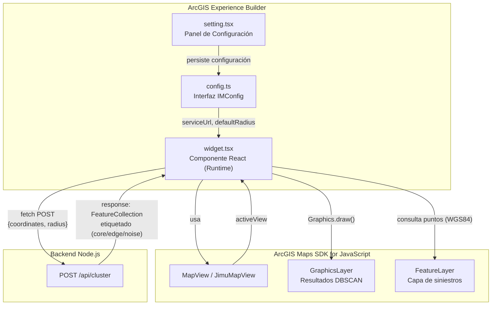

# Widget DBSCAN Clustering — ArcGIS Experience Builder


**Proyecto:** Concurso Datos al Ecosistema 2026 — IA para Colombia
**Sistema:** Predictivo de accidentalidad vial en Bogotá D.C.

Widget personalizado para **ArcGIS Experience Builder Developer Edition** que
integra el algoritmo de clustering espacial **DBSCAN** en el mapa. Permite al
usuario seleccionar una capa de puntos de siniestros viales, configurar el radio
de búsqueda y visualizar los clusters de alta densidad directamente en el mapa.

---

## Arquitectura



**Flujo de datos:**
1. El widget descubre automáticamente las capas de puntos del mapa
2. El usuario selecciona una capa y define el radio de búsqueda
3. Se consultan los puntos de la capa en coordenadas geográficas (WGS84, wkid: 4326)
4. Se envían las coordenadas al backend via `POST /api/cluster`
5. El backend ejecuta DBSCAN y devuelve los resultados etiquetados
6. El widget renderiza cada punto con color según su cluster ID
7. La vista del mapa se encuadra automáticamente a los resultados

---

## Tecnologías y Herramientas

| Tecnología | Versión | Propósito |
|---|---|---|
| **ArcGIS Experience Builder** | 1.20 | Plataforma de desarrollo de widgets personalizados |
| **React** | 18.x | Librería de UI (componentes funcionales con hooks) |
| **TypeScript** | 4.x | Tipado estático para el código del widget |
| **jimu-core** | 1.20 | Framework base de Experience Builder (props, estado) |
| **jimu-arcgis** | 1.20 | Puente entre React y la ArcGIS Maps SDK for JavaScript |
| **jimu-ui** | 1.20 | Componentes de UI (Button, Select, NumericInput, Alert) |
| **ArcGIS Maps SDK for JS** | 4.x | Renderizado de mapas, consultas, gráficos |

---

## Funcionalidades

- **Selección inteligente de capas**: descubre automáticamente las capas de puntos
  del mapa activo y las presenta en un selector desplegable.
- **Radio configurable**: entrada numérica para definir el radio de búsqueda en
  metros (parámetro `maxDistance` del algoritmo DBSCAN).
- **Ejecución asíncrona**: envía los puntos al backend y espera la respuesta
  sin bloquear la interfaz.
- **Visualización por clusters**: cada cluster se renderiza con un color
  distintivo de una paleta de 10 colores. Los puntos clasificados como `noise`
  se muestran con una marca "x" en gris.
- **Popup interactivo**: cada punto renderizado tiene un popup que muestra su
  clasificación DBSCAN (`core`, `edge` o `noise`) y el ID del cluster.
- **Auto-zoom**: después del clustering, la vista del mapa se encuadra
  automáticamente a la extensión de los resultados.
- **Manejo de errores**: muestra alertas descriptivas si falla la conexión con
  el backend o si la capa no devuelve puntos.
- **Limpieza de resultados**: botón para remover los resultados del mapa.
- **Configuración persistente**: la URL del backend y el radio por defecto se
  configuran en el panel de ajustes del widget y se persisten en la aplicación.

---

## Estructura del Proyecto

```
frontend-dbscan-clustering/
├── src/                       # Código fuente del widget
│   ├── config.ts              # Interfaz de configuración (serviceUrl, defaultRadius)
│   ├── runtime/
│   │   └── widget.tsx         # Componente principal del widget (runtime)
│   └── setting/
│       └── setting.tsx        # Panel de configuración (builder mode)
├── config.json                # Configuración por defecto del widget
├── icon.svg                   # Icono del widget en el builder
├── manifest.json              # Metadatos del widget (nombre, versión, dependencias)
└── README.md
```

---

## Instalación

### Requisitos

- **ArcGIS Experience Builder Developer Edition** v1.20 o superior
  ([Guía de instalación](https://developers.arcgis.com/experience-builder/guide/install-guide/))
- **Node.js** ≥ 18
- **Backend DBSCAN** corriendo (ver `backend-dbscan-clustering/`)

### Pasos

1. Clona o copia la carpeta `frontend-dbscan-clustering/` en el directorio
   `widgets/` de tu instalación de Experience Builder Developer Edition:

   ```bash
   # En la raíz de Experience Builder Developer Edition
   cp -r /ruta/al/proyecto/frontend-dbscan-clustering widgets/
   ```

2. (Opcional) Si tu instalación de Experience Builder no tiene el widget registrado
   automáticamente, agrega la ruta en el archivo de configuración de widgets.

3. Inicia el servidor de desarrollo de Experience Builder:

   ```bash
   npm start
   ```

4. Abre el builder en `https://localhost:3001`, agrega el widget "DBSCAN Clustering"
   al lienzo y configura la URL del backend en el panel de ajustes.

> **Nota:** El widget no se instala mediante `npm install` directamente. Se integra
> copiando la carpeta en la estructura de widgets de Experience Builder Developer
> Edition, que ya incluye las dependencias `jimu-core`, `jimu-arcgis` y `jimu-ui`.

---

## Configuración

### Panel de Ajustes (modo diseño)

| Parámetro | Descripción | Valor por defecto |
|---|---|---|
| **Widget de mapa** | Selecciona el mapa al que se conecta el widget | — |
| **URL del servicio** | Endpoint POST del backend DBSCAN | `https://backend-clustering-tybg.onrender.com/api/cluster` |
| **Radio por defecto (m)** | Radio de búsqueda inicial en metros | `150` |

### Archivo `config.json`

```json
{
  "serviceUrl": "https://backend-clustering-tybg.onrender.com/api/cluster",
  "defaultRadius": 150
}
```

---

## API del Backend (referencia)

### `POST /api/cluster`

Envía los puntos y el radio para ejecutar DBSCAN.

**Body:**
```json
{
  "points": [[-74.08, 4.60], [-74.081, 4.601]],
  "radius": 150
}
```

**Respuesta:**
```json
{
  "clusters": {
    "type": "FeatureCollection",
    "features": [
      {
        "type": "Feature",
        "geometry": { "type": "Point", "coordinates": [-74.08, 4.60] },
        "properties": { "dbscan": "core", "cluster": 0 }
      }
    ]
  },
  "meta": {
    "radiusMeters": 150,
    "minPoints": 20,
    "totalPoints": 2,
    "clusterCount": 1,
    "noiseCount": 0
  }
}
```

> Para más detalles, consulta la documentación del backend en
> `backend-dbscan-clustering/README.md`.

---

## Personalización

### Paleta de colores

Puedes modificar la paleta de colores editando `CLUSTER_COLORS` en
`src/runtime/widget.tsx:26`. Actualmente tiene 10 colores RGB:
```typescript
const CLUSTER_COLORS: number[][] = [
  [46, 134, 193], [231, 76, 60], [39, 174, 96], [241, 196, 15],
  [155, 89, 182], [230, 126, 34], [26, 188, 156], [52, 73, 94],
  [211, 84, 0], [22, 160, 133]
]
```

### Parámetro minPoints

El backend está configurado con un mínimo de **20 puntos** por cluster
(`MIN_POINTS` en `dbscan.ts`). Para cambiarlo, modifica el valor en el
archivo fuente del backend y recompila.
