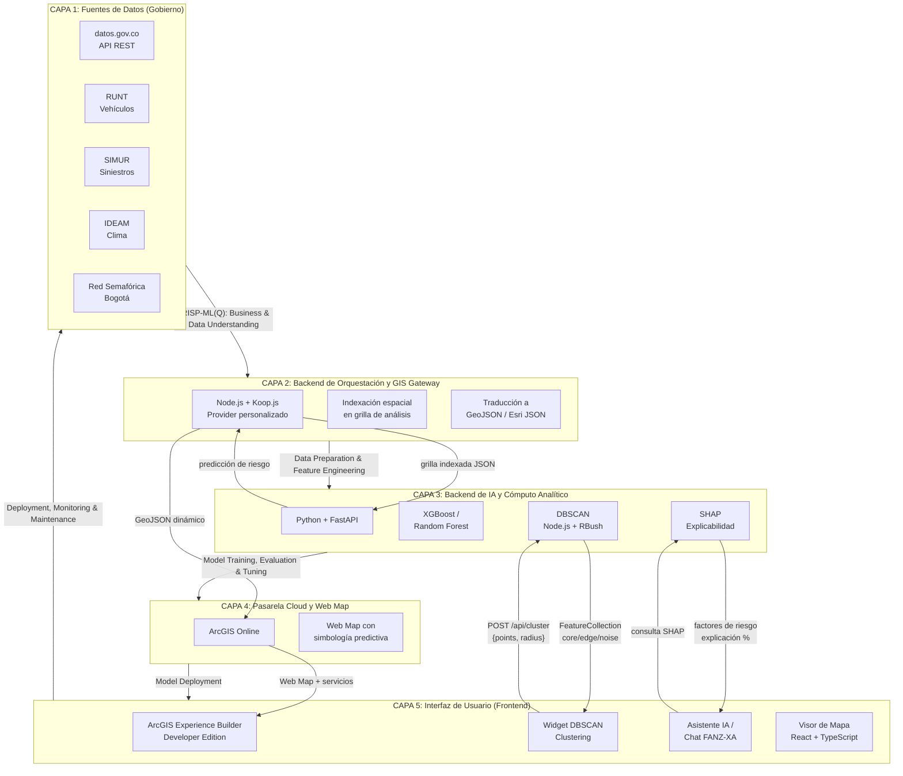

# Concurso Datos al Ecosistema 2026: IA para Colombia

**Sistema predictivo de accidentalidad vial con inteligencia artificial y análisis espacial**

[](https://developers.arcgis.com/experience-builder/)
[](https://nodejs.org/)
[](https://www.typescriptlang.org/)
[](https://www.python.org/)

---

## Diagrama de Arquitectura



---

## Metodología: CRISP-ML(Q)

El sistema sigue el estándar **CRISP-ML(Q)** (*CRoss-Industry Standard Process for Machine Learning with Quality Assurance*) en 5 capas desacopladas:

### Capa 1: Orígenes de Datos (Gobierno)
**Fase CRISP-ML(Q):** Comprensión del Negocio y de los Datos.

Fuentes de datos abiertos colombianos consultadas al vuelo:
| Fuente | Datos | URL |
|---|---|---|
| **SIMUR** | Histórico de siniestros viales (2007–2026) ~899k registros | `sig.simur.gov.co` |
| **Datos Abiertos Colombia** | Siniestros consolidados, red semafórica | `datos.gov.co` |
| **RUNT** | Vehículos involucrados en accidentes | `datos.gov.co` |
| **IDEAM** | Precipitación, temperatura, humedad | `datos.gov.co` |

### Capa 2: Backend de Orquestación y GIS Gateway
**Fase CRISP-ML(Q):** Data Preparation.

Tecnología: **Node.js + Koop.js** — Provider personalizado que:
1. Intercepta la petición espacial (Bounding Box) desde el mapa
2. Indexa los datos planos en una grilla de análisis estructurada
3. Orquesta el backend analítico enviando la grilla indexada
4. Expone la respuesta como GeoJSON / Esri JSON hacia ArcGIS Online

### Capa 3: Backend de Inteligencia Artificial y Cómputo Analítico
**Fase CRISP-ML(Q):** Model Training, Evaluation & Tuning.

Tres motores analíticos:

| Motor | Tecnología | Función |
|---|---|---|
| **Predicción de riesgo** | Python + FastAPI + XGBoost/Random Forest | Estima % de probabilidad y severidad de siniestros por celda |
| **Explicabilidad SHAP** | Python + SHAP | Calcula qué variables impulsan la predicción en cada punto |
| **Clustering DBSCAN** | Node.js + Turf.js + RBush | Agrupa puntos por densidad (widget interactivo) |

### Capa 4: Pasarela Cloud y Web Map
**Fase CRISP-ML(Q):** Model Deployment.

Tecnología: **ArcGIS Online (AGOL)**.
- Registra la URL del servidor Koop.js como un Item Web
- Configura el Web Map con simbología predictiva condicional
- Sirve capas enriquecidas de forma optimizada al cliente

### Capa 5: Interfaz de Usuario (Frontend)
**Fase CRISP-ML(Q):** Deployment, Monitoring & Maintenance.

Tecnología: **ArcGIS Experience Builder Developer Edition** (React + TypeScript + ArcGIS Maps SDK for JavaScript).

Componentes clave:
- **Widget DBSCAN Clustering** — Selecciona capas de puntos, ejecuta DBSCAN en backend, renderiza resultados coloreados por cluster
- **Asistente IA / Simulador Preventivo** — Chat conversacional que combina atributos del mapa con cálculos SHAP
- **Visor de Mapa Web** — Renderiza el mapa predictivo con simbología condicional

---

## Repositorio

```
/
├── backend-dbscan-clustering/    # Backend DBSCAN (Node.js, Express, RBush, Turf.js)
│   ├── src/
│   │   ├── server.ts             # Servidor Express (POST /api/cluster, GET /health)
│   │   ├── dbscan.ts             # Implementación DBSCAN optimizada con R-tree
│   │   └── types.ts              # Interfaces compartidas
│   ├── dist/                     # Código compilado (JavaScript)
│   ├── package.json
│   ├── tsconfig.json
│   └── README.md
│
├── frontend-dbscan-clustering/   # Widget personalizado para ArcGIS Experience Builder
│   ├── src/
│   │   ├── config.ts             # Interfaz de configuración del widget
│   │   ├── runtime/
│   │   │   └── widget.tsx        # Componente principal (React runtime)
│   │   └── setting/
│   │       └── setting.tsx       # Panel de configuración (builder mode)
│   ├── manifest.json             # Metadatos del widget
│   ├── config.json               # Configuración por defecto
│   └── README.md
│
├── arquitectura.md               # Documentación detallada de la arquitectura
├── datos.md                      # Catálogo de fuentes de datos abiertos
├── images/                       # Diagramas y capturas de pantalla
├── LICENSE                       # Licencia Apache 2.0
└── README.md                     # Este archivo
```

---

## Propuesta

> **Sistema predictivo de accidentalidad vial basado en inteligencia artificial y análisis espacial**

Desarrollo de un sistema de predicción espacial de accidentalidad vial que permite identificar y agrupar zonas urbanas con alta probabilidad de ocurrencia de siniestros antes de que estos sucedan. El sistema implementa una arquitectura desacoplada de alto rendimiento que orquesta e integra de forma asíncrona datos abiertos de gobierno (histórico de siniestros, red semafórica e infraestructura vial) con variables climáticas. Mediante la metodología estándar CRISP-DM (desde la preparación de datos hasta el despliegue), la iniciativa procesa la información a través de un backend dual (Node.js/Koop.js para indexación espacial en grilla y Python/FastAPI para cómputo de machine learning) para detectar patrones territoriales de riesgo de siniestralidad. Esto permite priorizar intervenciones urbanas preventivas y visualizar resultados analíticos de manera inmediata mediante una aplicación web interactiva georreferenciada.

---

## Widgets Personalizados

### DBSCAN Clustering

Widget que permite al usuario seleccionar capas de puntos de siniestros e ingresar de manera interactiva el radio de búsqueda para calcular y renderizar en caliente agrupamientos de alta densidad. Implementa el algoritmo DBSCAN con una optimización basada en R-tree (RBush) para consultas de vecindad eficientes con miles de puntos.

**Flujo:**
1. El widget descubre capas de puntos en el mapa
2. El usuario selecciona capa y radio → consulta puntos en WGS84
3. Envío `POST /api/cluster` al backend
4. Backend ejecuta DBSCAN con RBush + Turf.js
5. Renderizado con colores por cluster y auto-zoom

### Asistente IA Interactivo (Chat Bot / Simulador Preventivo)

Asistente conversacional integrado que lee la memoria de los atributos del mapa en el navegador y la combina con una calculadora SHAP en el backend. Permite al usuario consultar factores de riesgo locales y simular escenarios preventivos (como instalar un semáforo virtual), recibiendo explicaciones porcentuales y respuestas en lenguaje natural.

---

## Enlaces

| Recurso | URL |
|---|---|
| Documentación ArcGIS Experience Builder Developer Edition | [developers.arcgis.com/experience-builder/guide/install-guide/](https://developers.arcgis.com/experience-builder/guide/install-guide/) |
| Configuración de asistentes IA en ArcGIS Online | [doc.arcgis.com/es/arcgis-online/administer/configure-assistants.htm](https://doc.arcgis.com/es/arcgis-online/administer/configure-assistants.htm) |
| Datos Abiertos Colombia | [datos.gov.co](https://www.datos.gov.co/) |

---

## Licencia

Este proyecto está licenciado bajo **Apache License 2.0** — ver el archivo [LICENSE](LICENSE) para más detalles.
