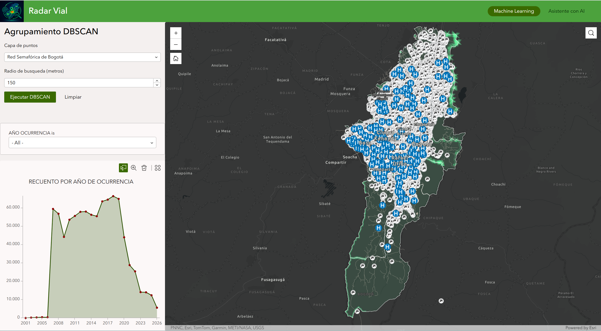
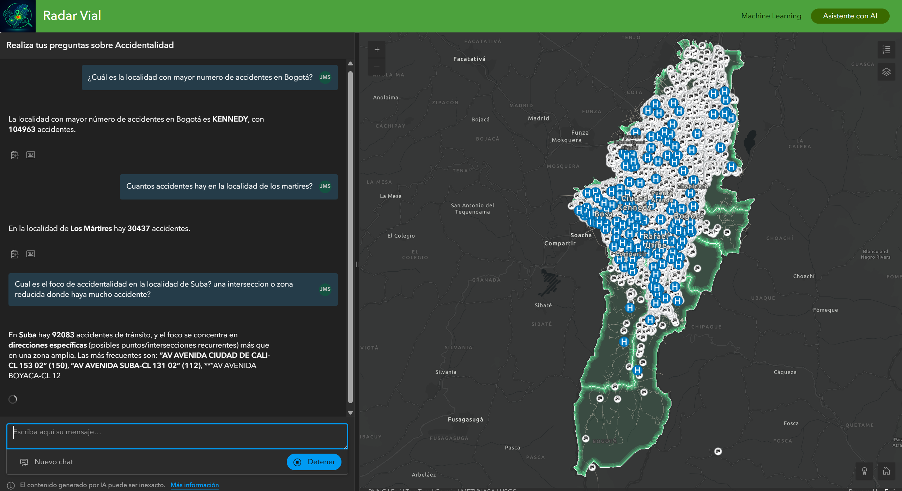

# Concurso Datos al Ecosistema 2026: IA para Colombia

**Sistema de clustering espacial DBSCAN y asistente IA para análisis de accidentalidad vial en Bogotá**

---

## Descripción del proyecto

Plataforma web geoespacial construida sobre **ArcGIS Experience Builder Developer Edition** que integra dos funcionalidades principales sobre datos de siniestros viales de Bogotá:

- **Widget DBSCAN Clustering** — Widget personalizado React/TypeScript que se conecta con un backend Node.js independiente para ejecutar clustering DBSCAN optimizado con R-tree (RBush) sobre capas de puntos, agrupándolos por densidad y visualizando los resultados coloreados directamente en el mapa.

- **Asistente IA (Instant App embebido)** — Instant App de ArcGIS Online con un asistente conversacional de IA integrado dentro del Experience Builder. Lee los atributos del mapa en memoria (client-side) y permite al usuario consultar información del territorio en lenguaje natural, analizar el contexto de las capas activas y recibir respuestas inteligentes para la toma de decisiones.

---

## Cómo funciona

El proyecto combina tres componentes que trabajan en conjunto:

1. **Widget DBSCAN (Experience Builder)** — Un widget personalizado React + TypeScript que descubre automáticamente las capas de puntos del mapa, permite seleccionar una capa y configurar el radio de búsqueda en metros, consulta los puntos en coordenadas WGS84 y los envía al backend vía `POST /api/cluster`. Al recibir la respuesta, renderiza cada punto sobre una GraphicsLayer con color según su cluster (los puntos de ruido se marcan con aspas grises) y encuadra la vista a los resultados.

2. **Backend DBSCAN (Node.js + Express)** — Servidor independiente que recibe coordenadas y radio, ejecuta el algoritmo DBSCAN utilizando un índice espacial R-tree (RBush) para optimizar las consultas de vecindad, y devuelve el FeatureCollection con cada punto clasificado como `core`, `edge` o `noise` más los metadatos del agrupamiento.

3. **Asistente IA (Instant App)** — Una Instant App de ArcGIS Online embebida como widget dentro del Experience Builder. Utiliza un asistente conversacional de IA configurado desde ArcGIS Online que lee los atributos del mapa en memoria (client-side memory) para contextualizar las respuestas. El usuario puede interactuar en lenguaje natural preguntando sobre el territorio, las capas activas de infraestructura y siniestralidad, recibiendo respuestas inteligentes para apoyar la toma de decisiones institucionales.

---

## Capturas de la aplicación

### Vista general de la aplicación

### Ejecución del clustering DBSCAN

### Asistente IA respondiendo consultas

---

## Despliegue

El **backend DBSCAN** está desplegado en Render y disponible en:

| Recurso | URL |
|---|---|
| Healthcheck | [https://backend-clustering-tybg.onrender.com/health](https://backend-clustering-tybg.onrender.com/health) |
| Endpoint de clustering | `POST https://backend-clustering-tybg.onrender.com/api/cluster` |

El **frontend** (ArcGIS Experience Builder) corre de forma local con el servidor de desarrollo de Experience Builder Developer Edition (`npm start` en `https://localhost:3001`), o puede ser desplegado como una aplicación web estática en cualquier hosting.

---

## Componentes del repositorio

| Carpeta | Descripción | Documentación |
|---|---|---|
| `backend-dbscan-clustering/` | Backend Node.js/Express que ejecuta DBSCAN con índice espacial R-tree (RBush) para clustering de puntos geográficos | [README](backend-dbscan-clustering/README.md) |
| `frontend-dbscan-clustering/` | Widget personalizado React/TypeScript para ArcGIS Experience Builder que envía puntos al backend y renderiza los clusters en el mapa | [README](frontend-dbscan-clustering/README.md) |
| [`arquitectura.md`](arquitectura.md) | Documentación detallada de la arquitectura del sistema por capas |
| [`datos.md`](datos.md) | Catálogo de fuentes de datos abiertos utilizados |

---

## Enlaces de interés

| Recurso | URL |
|---|---|
| Documentación ArcGIS Experience Builder Developer Edition | [developers.arcgis.com/experience-builder/guide/install-guide/](https://developers.arcgis.com/experience-builder/guide/install-guide/) |
| Configuración de asistentes IA en ArcGIS Online | [doc.arcgis.com/es/arcgis-online/administer/configure-assistants.htm](https://doc.arcgis.com/es/arcgis-online/administer/configure-assistants.htm) |
| Datos Abiertos Colombia | [datos.gov.co](https://www.datos.gov.co/) |

---

## Licencia

**Apache License 2.0** — ver [LICENSE](LICENSE).
